# Rechnerarchitektur

## CPU-Architektur

### CPU-Register

* Program Counter (PC)
  * Adresse des gerade ausgeführten Befehls
* Instruction Register (IR)
  * Gerade in Ausführung befindlicher Befehl
* Stack Pointer (SP)
  * Adresse des Stacks
* Flags
  * Überlauf, Ergebnis von Vergleichen, Shift Bit
* General Purpose Register (R1, R2, ...)
  * Weitere Unterscheidung möglich
     * Datenregister
     * Adressregister

### ALU (Arithmetic Logical Unit)

** Befehlsausführung wie folgt:**

1. Lesen der nächsten Anweisung in das IR
2. PC erhöhen
3. Art und Adressierung der Anweisung ermitteln
4. Wenn ein Wort aus dem Speicher benötigt wird, dann rechne die Adresse aus
5. Laden der Werte aus dem Speicher in die Register
6. Ausführen der Instruktion
7. Eventuell Zurückschreiben von Werten (Ergebnis) in den Speicher
8. Weiter mit Schritt 1

**Fetch-Decode-Execute-Cycle**

### RISC vs CISC

* Komplexität der Befehle die eine CPU beherrscht
* CPU kann bei Bekanntheit der Befehle vorausschauend effizient arbeiten

#### CISC (Complex Instruction Set Computing)

> Komplexe aber langsame Befehle, die mehrere Takte benötigen.

* Komplexe Befehle > Komplexe Schaltungen > Große Siliziumflächen > hohe Kosten?
  * Zerlegung der Befehle 
  * Kleiner Interpreter > weniger Silizium
*  Vorteile
  * Parallele Ausführung > mehr Effizienz
  * CPU kann neue Befehle lernen durch Änderung der Mikroarchitektur
* Nachteile
  * Komplexe Befehle > Zeitaufwand hoch > langsam
  * Parallelisierung ist kompliziert > mehr Schaltungen > mehr Silizium > teuer

#### RISC (Reduced Instruction Set Computing)

> Einfache aber schnelle Befehle, die lediglich einen Takt benötigen.

* Viele Register im Vergleich zu CISC
* Vorteile
  * Einfache Logik > weniger Schaltungen > billiger
  * Zeitweise schneller als CISC
* Nachteile
  * Programme werden größer
  * Compiler müssen Befehlsfolge optimieren
  * Nicht mehr effizient von Hand programmierbar

#### CISC / RISC - Mischformen

* Moderne Intel-CPUs kombinieren beide Chip-Arten
* Einfache RISC-Befehle
  * Direkte Ausführung > sehr schnell
  * Keine Interpretation durch die Mikroarchitektur
* Komplexe CISC-Befehle
  * Interpretation durch die Mikroarchitektur
  * Langsam aber kompatibel zu alten Intel-CPUs
  * RISC-Design > schnell und billig
  * Nachteil: Kompliziertes Chip Design

### Pipelines

### Parallele Pipelines

* Einige Befehle sind über parallele Pipelines ausführbar
* Anzahl paralleler Pipelines ist begrenzt
  * Viele Befehlsfolgen sind sowieso nicht parallelisierbar
  * Mit der Anzahl der Pipelines steigt der Bedarf an Silizium
  * Test auf Parallelisierbarkeit wird komplizierter

### Superskalare Prozessoren

* Einige Units sind schneller als andere
* Idee: Parallelisieren der langsamen Units
  * Speicherzugriffe
  * Rechenoperationen
* Vorteile
  * Weniger Silizium als für parallele Pipelines notwendig
  * Fast so schnell
  * Weniger Koordinationsprobleme

### Vektorrechner

### Parallelrechner

### Speicheradressen

### Word Alignment

* Lesen / Schreiben von ganzen Blocks in den Speicher
* 16 / 32 Bit Zugriffe
  * Lesen an einer ungeraden Speicheradresse ist oft langsam
* Anpassung der Datenstrukturen für CPUs

### Speicherhierarchie

### CPU Cache

## Kodierung

### Text-Kodierung

* Buchstaben, Symbole und Steuerzeichen werden kodiert (Rechner kann nur Zahlen darstellen)
* Anzahl der verfügbaren Buchstaben und Symbole hängt von der Kodierung (Interpretation) ab

#### Unicode

* Jedes Zeichen hat eine eindeutige Zahl als Identifikator
* Verschiedene Kodierungen möglich (Unicode transformation formats)
  * UTF-8 (variable Länge 1-4 Bytes)
     * Verschwendet Bits bei nicht ASCII Zeichen
  * UTF-16 (variable Länge 2-4 Bytes)
     * Jedes Zeichen nutzt 16 Bit oder ein Vielfaches
     * Zeichen oberhalb 0xFFFF werden als Sequenz von 16-Bit-Worten dargestellt
     * Little-Endian, Big-Endian, BOM
  * UTF-32 (fixe Länge 4 Bytes)
     * Alle Zeichen sind 4 Bytes lang
     * Verschwendet zu viele Bits

#### Byte Order

* Bestimmt Anordnung der Bytes
* Vorteile von Little-Endian
  * Konvertierung zwischen 16 und 32-Bit kostet keine extra CPU-Zeit (Wird einfach verlängert)
  
## IO-Ports und Interrupts

### Zugriff auf Geräte

* Durch OS
  * Spezielle CPU-Anweisungen (IN, OUT)
  * Memory-Mapped IO
  * DMA (Direct Memory Access)
* Durch Benutzerprogramme
  * Kein direkter Zugriff auf Hardware erlaubt
    * Zusätzlicher Aufwand
  * Spezielle OS-Funktionen
  * Datei-Abstraktionen
    * Hardwareinformationen werden über das FileSystem dargestellt und auch gesteuert

### IO-Ports

* Ansprechbar über Adressen
* Port verfügt über 5 Register
  * Status Register
     * Read-Only
     * Status über Fehler, Befehl ausgeführt, Daten zum lesen bereit
  * Control Register
     * parity checking, word length, full/half duplex
  * Command Register
     * CPU schickt Aufträge an den Controller
  * Data-In Register
     * CPU liest Daten vom Controller
  * Data-Out Register
     * CPU schickt Daten an den Controller

### Memory-Mapped vs IN/OUT-Instruktionen

TODO

### Direct Memory Access (DMA)

* IO-Ports und Memory-Mapped IO brauchen viel CPU-Zeit
* DMA Controller entlasten die CPU
* CPU bestimmt
   * Gerät
   * Quell-Bytes
   * Ziel-Bytes
   * DMA übernimmt Job
   * Bei Fertigstellung folgt ein Interrupt an die CPU

### IO-Port Polling

* Die CPU will ein Kommando an den Controller schicken

1. Busy-Bit im Statusregister muss leer sein > Controller darf also nicht beschäftigt sein.
2. Setzt das Command und das Data-Out Register
3. Setzt Command-Ready Bit im Control Register
4. Controller erkennt Command-Ready Bit und setzt Busy-Bit im Status Register
5. Controller führt Command auf Grundlage von Data-Out Register aus
6. Controller löscht das Command-Ready und das Busy Bit
7. CPU bemerkt, dass der Controller fertig ist (Busy Bit ist gelöscht) und liest die Daten aus dem Data-In Register aus

* Polling ist sehr schnell
  * 3 Maschinenbefehle (Lesen des Registers, Logical And für Busy Bit Extraktion), Bedingtes Verzweigen
* Benachrichtigung des CPUs durch den Controller über Interrupts damit es zwischenzeitlich andere Jobs erledigen kann > Polling entfällt????

### Interrupt Controller

* PIC (Programmable Interrupt Controller)
* 8 verschiedene Interrupts möglich
* Interrupt Multiplexing
  * Mehrere IO-Controller können gleichzeitig Interrupt auslösen
  * Entscheidung durch PIC über Reihenfolge der Abarbeitung
  * Verwaltung einer Warteschlange über angeforderte Interrupts
* Kaskadierung möglich
  * Interrupt kann einen anderen unterbrechen
* Register
  * Interrupt Request Register (IRR)
     * Ein Bit pro IO-Controller
  * Interrupt Service Register (ISR)
     * Ein Bit pro IO-Controller
     * Zeigt an, wessen Interrupt gerade ausgefürt wird, bzw. wessen Interrupt in der Ausführung unterbrochen wurde
  * Interrupt Mask Register (IMR)
     * Schaltet einzelne Interrupts aus

#### Auslösen von Interrupts

1. Der IO-Controller signalisiert dem PIC, dass er einen Interrupt wünscht
2. Das Bit im IRR wird gesetzt
3. Wenn z.Z. kein Interrupt ausgeführt wird (IRS=0), dann Setzen des Bit im IRS, Löschen des Bit im IRR
4. Der Interrupt wird an die CPU weitergeleitet und die Nummer des Interrupts auf den Bus gelegt
5. Die CPU holt die Interrupt Nummer vom Bus und schaut im Interrupt-Vektor nach
6. Die CPU ist fertig. Das Bit im IRS wird gelöscht
7. Wenn im IRS noch Bits gesetzt sind, dann geht es mit Schritt 4 weiter

## Speichermedien

### Festplatten

* Oberflächen, Zylinder, Spuren, Sektoren, Blöcke, Köpfe, Zonen
* Präamble markiert den Anfang eines Blocks/Sektors
* ECC korrigiert Fehler
* 512 Byte für einen Block
* <= 16 für ECC Fehlerkorrektur

### Festplattengeometrie

* Geometrie wird definiert durch Köpfe, Zylinder, Sektoren
* Große Festplatten nutzen virtuelle Geometrie wegen der 16-Bit Grenze
  * Virtualisieren von weiteren Köpfen, die für einen ganz bestimmten Sektor verantwortlich sind
  * Austausch von defekten Sektoren ohne OS-Unterstützung
* LBA (Logical Block adressing)
   * 48 Bit für Blocknummer, 512 Byte pro Block
  
### Interleaving bei Festplatten

> Nötig, wenn Daten schneller am Lesekopf vorbeikommen, als sie von der Elektronik verarbeitet werden können.

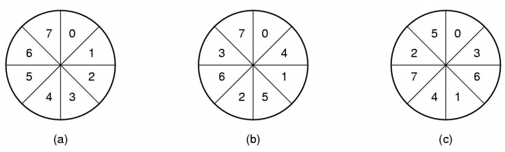

### Fehlerhafte Blöcke

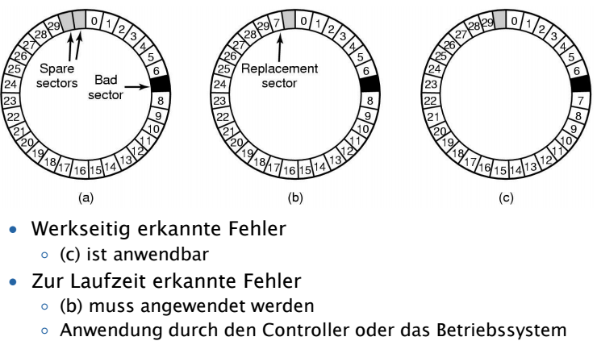

### Festplattenkapazität

* 20 GB > Unformatiert 20*10^9 Byte
* Low-Level-Formatierung
  * Blöcke enthalten Präambel und ECC
  * 2^34 = 17,2*10^9 Byte = 17,2 GB
* 2er-Potenzrechnung des Betriebssystems
  * 1GB sind 2^30 Byte und nicht 10^9
  * 16 GB bleiben übrig
* Dateisystem verbraucht weiteren Speicher (Verwaltungsdaten, Fragmentierung)

### Kopfbewegung: Shortest Seek First

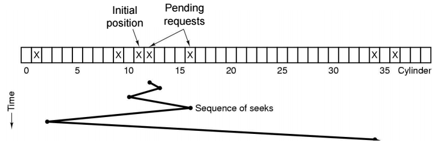

* SSF ist nicht fair
  * Sektoren in der Mitte werden bevorzugt
  * Sektoren am Rand werden benachteiligt

### Kopfbewegung: Aufzug-Algorithmus

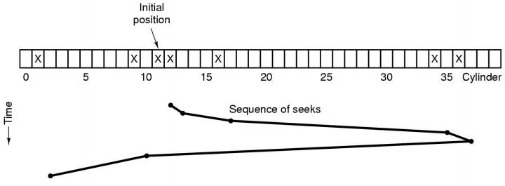

* Kopf bewegt sich so lange wie möglich in die gleiche Rechnung
* Minimiert Kopfbewegung
* Fairer Ansatz

### Boot

* Master-Boot-Record
  * Erster Block der Fesplatte
  * Enthält Boot-Loader-Code und Partitionstabelle

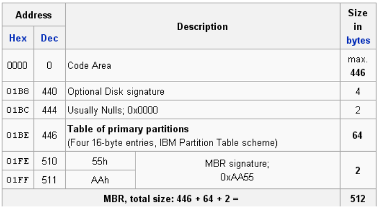

### Partitionen

* Primary (Logical)
  * Typ gibt Aufschluss über das Dateisystem
* Extended
  * Enthält wiederum Partitionen

### CD-ROM

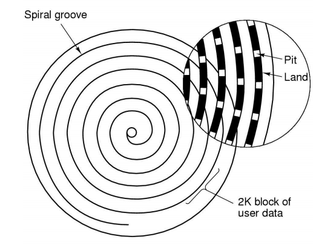

* Daten sind auf einer Spirale angeordnet
* Unterteilung in Sektoren
* Finden von Sektoren
  * Ungefähre Berechnung
  * Lesen bis zur nächsten Präambel
* Zugriffszeiten sehr viel schlechter als bei Festplatten
  * Dafür sequentielle Ablage der Dateien

### CD-ROM Dateisystem

* ISO 9660 Level 1
  * MS-DOS kompatibel
  * Dateinamen 8 + 3 (msdoof.exe) Zeichen
  * Ordner max. 8 Zeichen
* Rockridge Extensions
  * Level 1 nicht für UNIX
  * Längere Dateinamen
  * Zugriffs- und Ausführungsrechte
  * Benutzer- und Gruppen-ID
  * Symbolic Links

### CD-R

* VTOC (Volume Table of Contents) am Anfang (Verzeichnis)
* Unveränderbar nach dem Schreiben
* Multi-Session CDs
  * Meherere Spuren
  * Jede Spur hat VTOC, der die vorderen VTOCs ersetzt
  * Löschen / Hinzufügen von Daten möglich

### CD-R Schreiben

* Schreiben von CD-Rs auch aus physikalischen Gründen notwendig
* OS muss Dateien schnell genug bereitstellen
  * Ansonsten kommt es zum Abbruch
* Lösung 
  * Erstellung des CD-Images
  * Pufferung, um Aussetzer von Festplatten vorzubeugen
  * Kein Paging oder CPU-Entzug für CD-Schreibende Prozesse

### DVD (Digital Video Disc)

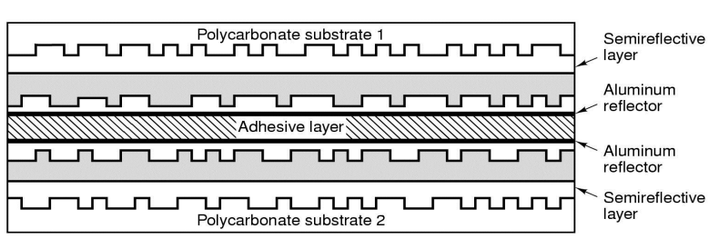

### RAID (Redundant Array of Independent Disks)

* Zusammenschluss von mehreren Festplatten
* Ziel
  * Erhöhung der Datensicherheit (Redundanz)
  * Steigerung der Transferrate (Performanz)
  * Aufbau großer logischer Laufwerke
  * Hot-Swap: Austausch von Festplatten on-the-fly
  * Kostenreduktion durch kleinere und billigere Festplatten

#### Hardware-RAID

* RAID-Controller
  * Übernimmt die komplette Arbeit
  * Anschluss mehrerer Platten an den Controller (physische Sicht)
  * Das OS sieht eine oder mehrere Platten (logische Sicht)
  * Logische und physische Sicht sind unabhängig
    * Bsp.: 4 physische billige Festplatten > 2 logische zuverlässige Platten

#### Software-RAID

* Controlling übernimmt OS
  * OS sieht alle physischen Festplatten
  * OS stellt logische Festplatten zu Verfügung
* Anwendungen können zwischen software und hardware-RAIDs nicht unterscheiden
* Preis / Leistung

#### Software vs Hardware-RAID
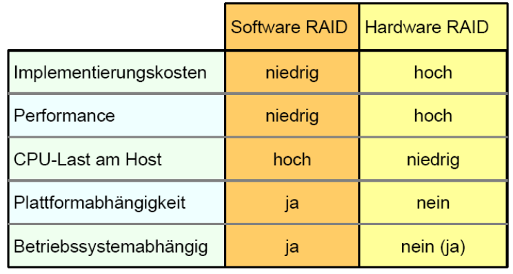

#### RAID-Levels

* RAID 0: Striping
* RAID 1: Mirroring
* RAID 2: Hamming-Codes
* RAID 3: RAID 2 mit Parität
* RAID 4: Strping mit separater Parität
* RAID 5: Performance + Parität
* RAID 6: 2x Fehlerkorrekturinformationen

#### Parity Bits

* Single-Bit-Errors Erkennung
* Count der 1-Bits ist gerade = 0er-Bit hinzufügen
* Count der 1-Bits ist ungerade = 1er-Bit hinzufügen
* Hamming-Distance: h = 2
  * Kann 1er Single-Bit-Errors erkennen
* Result: Count von 1er-Bits ist immer gerade
* ERROR: Wenn Count der 1er-Bits ist nicht gerade

#### Hamming Distance

* Definition: Hamming Distance h
  * Let ci and ck be any two code words
  * Let x i,k = ci XOR ck
  * h = the minimum of 1-bits in all xi,k
* Informally spoken:
  * The minimum number of different bits
* To detect d bit errors
  * h = d+1
* To correct d bit errors
  * h = 2d+1

#### A [7,4] Hamming Code

TODO

#### RAID-Level 0 (Striping)

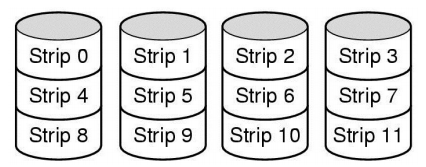

* Daten werden zerlegt auf mehrere "Stripes"
* Paralleles Lesen und Schreiben > Sehr schnell
* Keine Redundanz > Ausfall bedeutet Datenverlust

#### RAID-Level 1 (Mirroring)

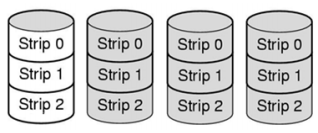

* Komplette Spiegelung der Daten
* Kein Problem bei Ausfall einer Platte
* Mirroring: Alle Platten an einem Controller
* Duplexing: Alle Platten an verschiedenen Controllern
* Mehrfache Redundanz
* Lesen kann beschleunigt werden:
  * Alle 4 Platten lesen einen anderen Block
  * Alle 4 Platten lesen den gleichen Block und vergleichen diese (sicher)
* Schreiben langsamer als RAID 0
  * Alle 4 Platten schreiben dasselbe

#### RAID-Leven 0+1 (Striping+Mirroring)
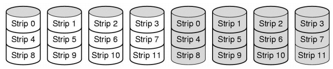
* Alle Daten auf zwei Platten
* Volle einmalige Spiegelung (Redundanz)
* Lesen wird beschleunigt
  * Alle 8 Platten lesen simultan
  * Ggf. jeweils 2 dasselbe (schnell vs. sicher)
  * Schreiben hat keine Beschleunigung zu RAID 0
  * 8 Platten können parallel schreiben
  * Aber 2 jeweils dasselbe

#### RAID-Level 2

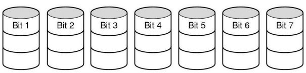

> Written with [StackEdit](https://stackedit.io/).